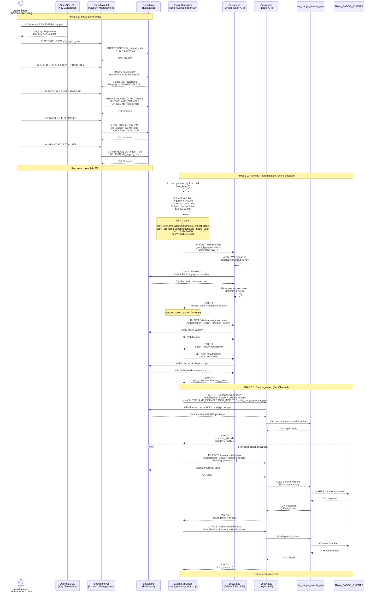
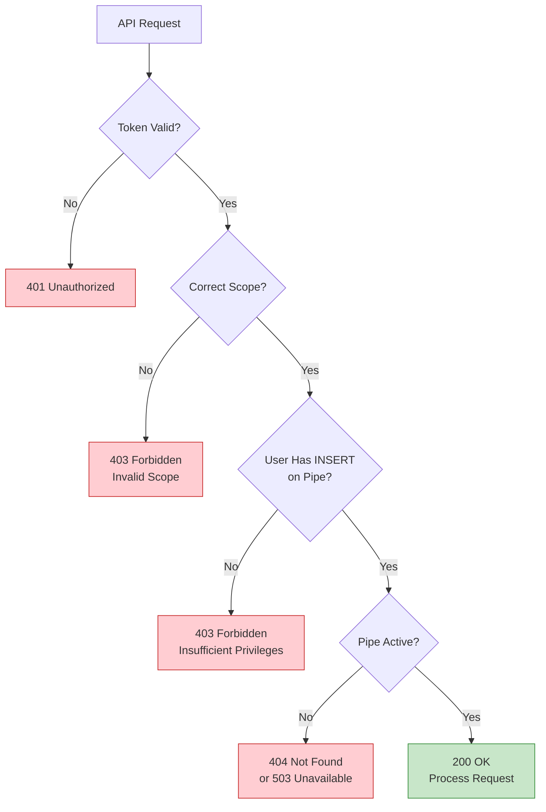
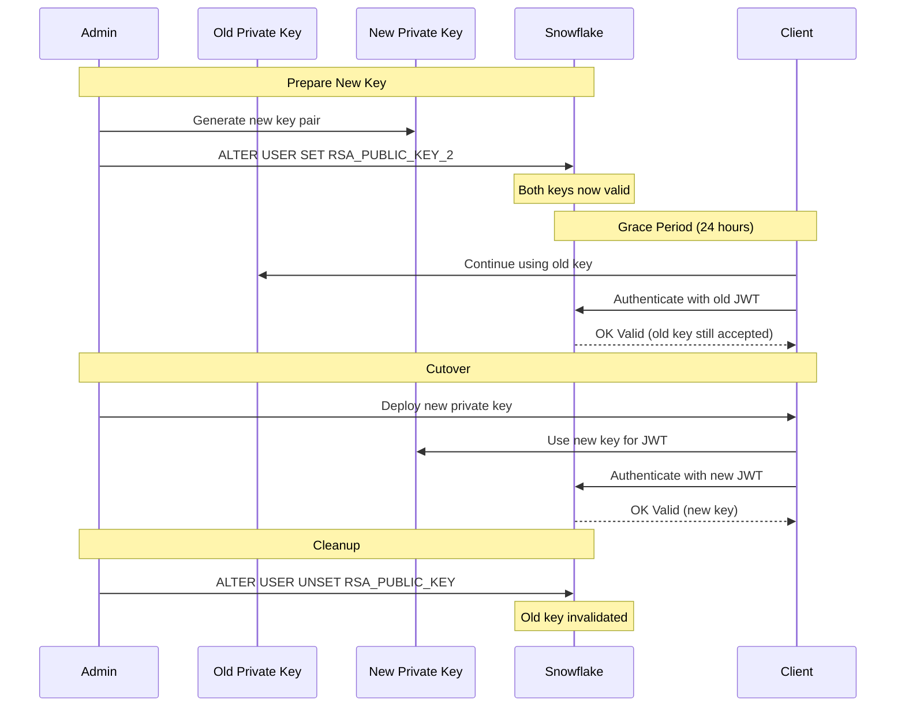

# Auth Flow - Simple Stream

**Author:** SE Community
**Created:** 2025-12-02
**Status:** Reference Implementation


DEMONSTRATION PROJECT - Timeboxed demo; lifecycle enforcement is implemented in `deploy_all.sql`.

**Reference Implementation:** This code demonstrates production-grade architectural patterns and best practices. Review and customize security, networking, and logic for your organization's specific requirements before deployment.

## Overview

This diagram shows the complete authentication and authorization flow for the Simple Stream pipeline, from RSA key pair generation through JWT creation, token exchange, and API authorization. The system uses key-pair authentication for enhanced security.

## Diagram



## Component Descriptions

### Phase 1: Setup (One-Time)

**RSA Key Pair Generation**
- **Tool:** OpenSSL (or ssh-keygen, or Python cryptography library)
- **Algorithm:** RSA 2048-bit minimum, 4096-bit recommended for long-term keys
- **Format:** PKCS#8 PEM (unencrypted for automation, encrypted for manual use)
- **Storage:** Private key NEVER committed to git (in .secrets/keys/, gitignored)
- **Distribution:** Public key registered with Snowflake, private key stays with client

**Commands:**
```bash
# Generate private key (PKCS#8, unencrypted)
openssl genrsa 2048 | openssl pkcs8 -topk8 -inform PEM -out rsa_key.p8 -nocrypt

# Extract public key (base64, single line for Snowflake)
openssl rsa -in rsa_key.p8 -pubout -outform DER | openssl base64 -A > rsa_key.pub.b64
```

**Service User Creation**
- **User Type:** SERVICE (not regular user, optimized for API access)
- **Naming Convention:** `sfe_ingest_user` (sfe = SnowFlake Example prefix)
- **Default Role:** `sfe_ingest_role` (minimal privileges)
- **Authentication:** Key-pair ONLY (no password set)

**SQL:**
```sql
CREATE USER sfe_ingest_user
  TYPE = SERVICE
  COMMENT = 'DEMO: Service account for Snowpipe Streaming ingestion';

CREATE ROLE sfe_ingest_role
  COMMENT = 'DEMO: Minimal role for pipe INSERT privileges';

GRANT ROLE sfe_ingest_role TO USER sfe_ingest_user;
```

**Public Key Registration**
- **Method:** ALTER USER ... SET RSA_PUBLIC_KEY
- **Format:** Base64-encoded DER (single line, no PEM headers)
- **Storage:** Snowflake stores SHA256 fingerprint, not the full key
- **Rotation:** Update with new key, old keys immediately invalid

**SQL:**
```sql
ALTER USER sfe_ingest_user
  SET RSA_PUBLIC_KEY = 'MIIBIjANBgkqhki...';

DESCRIBE USER sfe_ingest_user;
-- Note RSA_PUBLIC_KEY_FP (fingerprint for verification)
```

**Privilege Grants**
- **Database Level:** USAGE on SNOWFLAKE_EXAMPLE (allows listing schemas)
- **Schema Level:** USAGE on RAW_INGESTION (allows listing objects)
- **Pipe Level:** INSERT on sfe_badge_events_pipe (allows streaming data)
- **Principle:** Least privilege (NO SELECT, UPDATE, DELETE, DROP)

**SQL:**
```sql
GRANT USAGE ON DATABASE SNOWFLAKE_EXAMPLE TO ROLE sfe_ingest_role;
GRANT USAGE ON SCHEMA RAW_INGESTION TO ROLE sfe_ingest_role;
GRANT INSERT ON PIPE sfe_badge_events_pipe TO ROLE sfe_ingest_role;
```

### Phase 2: Runtime Authentication (Every Session)

**JWT Generation (Client-Side)**
- **Library:** PyJWT (Python), jose (Node.js), or equivalent
- **Algorithm:** RS256 (RSA with SHA-256)
- **Header:**
  ```json
  {
    "alg": "RS256",
    "typ": "JWT"
  }
  ```
- **Payload (Claims):**
  ```json
  {
    "iss": "orgname-accountname.sfe_ingest_user",
    "sub": "orgname-accountname.sfe_ingest_user",
    "iat": 1732464000,
    "exp": 1732467540
  }
  ```
- **Signing:** Sign payload with private key (RS256)
- **Expiry:** 59 minutes (max 60 minutes, leave 1 min buffer)

**Token Exchange**
- **Endpoint:** POST https://account.snowflakecomputing.com/oauth/token
- **Grant Type:** urn:ietf:params:oauth:grant-type:jwt-bearer
- **Parameters:**
  - `grant_type`: (as above)
  - `assertion`: (JWT string)
- **Response:**
  ```json
  {
    "access_token": "ver:1-hint:1234...",
    "token_type": "Bearer",
    "expires_in": 3600
  }
  ```
- **Caching:** Client should cache token and reuse until expiry

**Hostname Discovery**
- **Purpose:** Find optimal ingest endpoint (may differ from account URL)
- **Endpoint:** GET https://account.snowflakecomputing.com/v2/streaming/hostname
- **Headers:** Authorization: Bearer <session_token>
- **Response:**
  ```json
  {
    "hostname": "orgname-accountname.snowflakecomputing.com",
    "port": 443
  }
  ```
- **Caching:** Cache for session duration (typically same as account URL, but may differ)

**Scoped Token Request**
- **Purpose:** Get token specifically scoped for streaming (additional security layer)
- **Endpoint:** POST https://account.snowflakecomputing.com/oauth/token
- **Parameters:**
  - `grant_type`: urn:ietf:params:oauth:grant-type:jwt-bearer
  - `scope`: streaming
- **Response:** New token with streaming-specific privileges

### Phase 3: Data Ingestion (Per Channel)

**Channel Lifecycle**
1. **Open:** Establish streaming channel with pipe reference
2. **Append:** Stream batches of events (multiple requests)
3. **Close:** Gracefully close channel and flush pending data

**Authorization Checks (Per Request)**
- **Token Validity:** Verify token hasn't expired
- **Scope:** Verify token has streaming scope
- **Privilege:** Verify user has INSERT on target pipe
- **Pipe Status:** Verify pipe is active and healthy

**Exactly-Once Semantics**
- **Offset Tokens:** Server returns offset token after each batch
- **Idempotency:** Client can retry with same offset token (deduplication)
- **Crash Recovery:** Client stores offset token and resumes from last known offset

## Security Boundaries

### Authentication Layers

| Layer | Purpose | Credential | Lifetime |
|-------|---------|-----------|----------|
| 1. RSA Private Key | Root identity | Private key file | Years (rotate annually) |
| 2. JWT | Prove key ownership | Self-signed JWT | 59 minutes (max 60) |
| 3. Session Token | Account access | Bearer token from OAuth | 1 hour |
| 4. Scoped Token | Streaming access | Bearer token (scoped) | 1 hour |
| 5. Channel Authorization | Per-request auth | Channel ID + token | Session duration |

### Authorization Checks



## Credential Management Best Practices

### Private Key Security

**DO:**
- Store private keys outside of the repository
- Use global Git ignore and/or `.git/info/exclude` to prevent accidental commits
- Encrypt private keys at rest (filesystem encryption or key vault)
- Restrict file permissions (chmod 600 on Unix)
- Rotate keys annually or after suspected compromise
- Use separate keys per environment (dev, prod)

**DON'T:**
- NOT Commit private keys to git (even private repos)
- NOT Email private keys (use secure key exchange mechanisms)
- NOT Store private keys in environment variables
- NOT Share private keys across multiple applications
- NOT Use default/example keys in production

### Token Management

**DO:**
- Cache session tokens and reuse until expiry
- Implement token refresh logic (generate new JWT before expiry)
- Use HTTPS for all token exchanges (Snowflake enforces this)
- Store tokens in memory only (not on disk)

**DON'T:**
- NOT Log tokens (even in debug mode)
- NOT Include tokens in URLs (use Authorization header)
- NOT Store tokens in local storage or cookies (server-side only)

### Key Rotation Procedure



## Troubleshooting Authentication Issues

### Common Errors

| Error | HTTP Code | Cause | Resolution |
|-------|-----------|-------|-----------|
| JWT token is invalid | 401 | Signature doesn't match public key | Verify RSA_PUBLIC_KEY matches rsa_key.p8 |
| Token expired | 401 | JWT exp claim in past | Generate new JWT with future exp |
| User not found | 401 | Incorrect iss/sub claim | Use format: orgname-accountname.username |
| Insufficient privileges | 403 | User lacks INSERT on pipe | GRANT INSERT ON PIPE to user's role |
| Pipe not found | 404 | Incorrect pipe name or no USAGE grants | Verify fully qualified pipe name |
| Invalid scope | 403 | Token doesn't have streaming scope | Request scoped token with scope=streaming |

### Validation Queries

```sql
-- Check user exists and has public key registered
DESCRIBE USER SFE_INGEST_USER;

-- Check fingerprint matches (run this AFTER generating JWT)
SELECT SYSTEM$GET_LOGIN_FAILURE_DETAILS('<uuid from failed login>');

-- Check user's current role and grants
SHOW GRANTS TO USER SFE_INGEST_USER;

-- Check specific pipe privileges
SHOW GRANTS ON PIPE sfe_badge_events_pipe;

-- Check recent authentication attempts
SELECT
  event_timestamp,
  user_name,
  event_type,
  is_success,
  error_code,
  error_message,
  client_ip,
  client_type
FROM SNOWFLAKE.ACCOUNT_USAGE.LOGIN_HISTORY
WHERE USER_NAME = 'SFE_INGEST_USER'
ORDER BY EVENT_TIMESTAMP DESC
LIMIT 10;
```

### Debug Checklist

- [ ] Private key file exists and is readable (chmod 600)
- [ ] Public key registered with Snowflake (DESCRIBE USER shows RSA_PUBLIC_KEY_FP)
- [ ] JWT iss/sub claims use correct format (orgname-accountname.username)
- [ ] JWT exp claim is in future (< 60 minutes from iat)
- [ ] Session token obtained successfully (POST /oauth/token returns 200)
- [ ] Hostname discovery succeeds (GET /v2/streaming/hostname returns 200)
- [ ] Scoped token obtained (POST /oauth/token with scope=streaming)
- [ ] User has INSERT privilege on pipe (SHOW GRANTS)
- [ ] Pipe is active (SHOW PIPES shows EXECUTION_STATE)

## Change History

See Git history for change tracking.

## Related Diagrams
- `data-model.md` - Database schema and relationships
- `data-flow.md` - Data transformation pipeline
- `network-flow.md` - Network connectivity architecture
