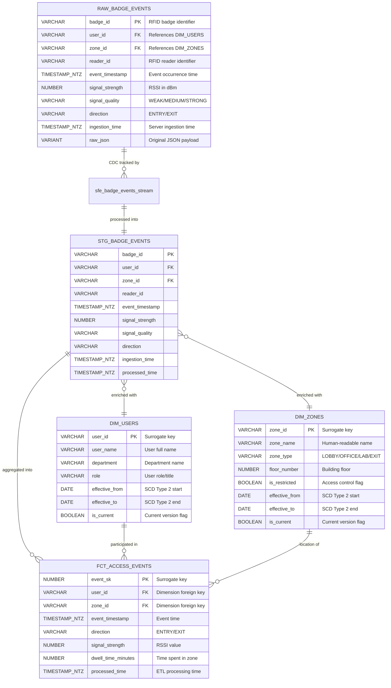

# Data Model - Simple Stream

**Author:** SE Community  
**Created:** 2025-11-24  
**Expires:** 2025-12-24 (30 days)  
**Status:** Reference Implementation


⚠️ **DEMONSTRATION PROJECT** - This demo expires on 2025-12-24 to ensure users encounter current Snowflake features only.

**Reference Implementation:** This code demonstrates production-grade architectural patterns and best practices. Review and customize security, networking, and logic for your organization's specific requirements before deployment.

## Overview

This diagram shows the complete data model for the Simple Stream pipeline, including raw ingestion tables, staging tables, dimensional tables, and fact tables. The model supports real-time RFID badge event processing with slowly changing dimensions.

## Diagram



## Component Descriptions

### RAW_INGESTION Schema

**RAW_BADGE_EVENTS**
- **Purpose:** Landing table for Snowpipe Streaming REST API
- **Technology:** Snowflake table with VARIANT support for semi-structured data
- **Location:** `SNOWFLAKE_EXAMPLE.RAW_INGESTION.RAW_BADGE_EVENTS`
- **Dependencies:** None (source of truth)
- **Update Pattern:** High-frequency inserts via Snowpipe Streaming (append-only)
- **Clustering:** Natural ingestion order (no explicit clustering key)

**sfe_badge_events_stream**
- **Purpose:** CDC stream tracking all changes to RAW_BADGE_EVENTS
- **Technology:** Snowflake Stream (standard stream, not append-only)
- **Location:** `SNOWFLAKE_EXAMPLE.RAW_INGESTION.sfe_badge_events_stream`
- **Dependencies:** RAW_BADGE_EVENTS
- **Consumption:** Read by `sfe_raw_to_staging_task` every 1 minute

### STAGING_LAYER Schema

**STG_BADGE_EVENTS**
- **Purpose:** Deduplicated, cleaned events ready for analytics
- **Technology:** Transient table (no Fail-safe needed)
- **Location:** `SNOWFLAKE_EXAMPLE.STAGING_LAYER.STG_BADGE_EVENTS`
- **Dependencies:** RAW_BADGE_EVENTS via stream
- **Update Pattern:** Incremental MERGE via task (every 1 minute)
- **Key Transformations:** Deduplication on (badge_id, event_timestamp), quality filtering

### ANALYTICS_LAYER Schema

**DIM_USERS** (Slowly Changing Dimension Type 2)
- **Purpose:** User master data with historical tracking
- **Technology:** Permanent table with SCD Type 2 pattern
- **Location:** `SNOWFLAKE_EXAMPLE.ANALYTICS_LAYER.DIM_USERS`
- **Dependencies:** Seeded with sample data
- **Update Pattern:** Infrequent updates via manual MERGE or separate ETL
- **Historical Tracking:** effective_from/effective_to, is_current flag

**DIM_ZONES** (Slowly Changing Dimension Type 2)
- **Purpose:** Physical zone/location master data
- **Technology:** Permanent table with SCD Type 2 pattern
- **Location:** `SNOWFLAKE_EXAMPLE.ANALYTICS_LAYER.DIM_ZONES`
- **Dependencies:** Seeded with sample data
- **Update Pattern:** Infrequent updates via manual MERGE or separate ETL
- **Historical Tracking:** effective_from/effective_to, is_current flag

**FCT_ACCESS_EVENTS** (Fact Table)
- **Purpose:** Analytics-ready fact table with enriched dimensions
- **Technology:** Permanent table, clustered by event_timestamp
- **Location:** `SNOWFLAKE_EXAMPLE.ANALYTICS_LAYER.FCT_ACCESS_EVENTS`
- **Dependencies:** STG_BADGE_EVENTS, DIM_USERS, DIM_ZONES
- **Update Pattern:** Incremental INSERT via task (every 1 minute, after staging task)
- **Clustering Key:** `TO_DATE(event_timestamp)` for time-based queries
- **Calculated Fields:** dwell_time_minutes (computed from entry/exit pairs)

## Data Lineage

```
RAW_BADGE_EVENTS (source)
    └─> sfe_badge_events_stream (CDC)
        └─> STG_BADGE_EVENTS (deduped)
            └─> FCT_ACCESS_EVENTS (enriched)
                ├─> JOIN DIM_USERS
                └─> JOIN DIM_ZONES
```

## Constraints and Data Quality

### Primary Keys
- All tables use surrogate keys or natural keys (badge_id, user_id, zone_id)
- Fact table uses auto-incrementing surrogate key (event_sk)

### Foreign Keys
- Enforced at application layer (Snowflake doesn't enforce FK constraints)
- Referential integrity validated in task logic
- Orphaned records logged to monitoring views

### Not Null Requirements
- RAW_BADGE_EVENTS: badge_id, user_id, zone_id, event_timestamp (all required)
- Dimensions: All key fields (user_id, zone_id, effective dates)
- Facts: All foreign keys and event_timestamp

### Unique Constraints
- RAW_BADGE_EVENTS: No explicit unique (allows duplicates for dedup logic)
- STG_BADGE_EVENTS: (badge_id, event_timestamp) enforced via MERGE
- Dimensions: (dimension_key, effective_from) for SCD Type 2

## Storage Optimization

### Table Types
- **RAW_BADGE_EVENTS:** Permanent (1-day Time Travel for recovery)
- **STG_BADGE_EVENTS:** Transient (no Fail-safe, reduces storage cost)
- **DIM_USERS:** Permanent (critical master data)
- **DIM_ZONES:** Permanent (critical master data)
- **FCT_ACCESS_EVENTS:** Permanent with clustering (analytics queries)

### Clustering Strategy
- **FCT_ACCESS_EVENTS:** Clustered by `TO_DATE(event_timestamp)`
  - Justification: Most queries filter by date ranges
  - Cardinality: ~365 distinct dates per year (optimal)
  - Maintenance: Auto-clustering enabled

## Change History

See `.cursor/DIAGRAM_CHANGELOG.md` for version history.

## Related Diagrams
- `data-flow.md` - How data moves through these tables
- `network-flow.md` - Network connectivity to Snowflake
- `auth-flow.md` - Authentication for data ingestion

