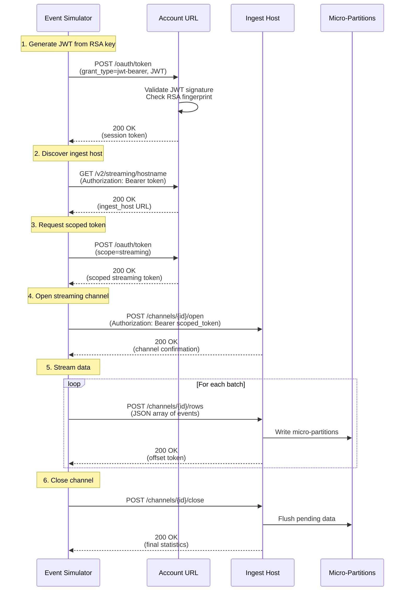

# Network Flow - Simple Stream

**Author:** SE Community
**Created:** 2025-12-02
**Status:** Reference Implementation


DEMONSTRATION PROJECT - Timeboxed demo; lifecycle enforcement is implemented in `deploy_all.sql`.

**Reference Implementation:** This code demonstrates production-grade architectural patterns and best practices. Review and customize security, networking, and logic for your organization's specific requirements before deployment.

## Overview

This diagram shows the network architecture and connectivity for the Simple Stream pipeline, including external data sources, Snowflake endpoints, authentication flows, and firewall requirements.

## Diagram

```mermaid
graph TB
    subgraph "External Network - Data Producer"
        RFID[RFID Badge System<br/>On-Premises or Cloud]
        SIM[Event Simulator<br/>Developer Laptop]
    end

    subgraph "Internet Boundary"
        FW1[Firewall / Proxy<br/>Outbound HTTPS:443]
    end

    subgraph "Snowflake Cloud - Control Plane"
        ACCOUNT[Account URL<br/>orgname-accountname.snowflakecomputing.com<br/>Port: 443 HTTPS]

        subgraph "Services"
            SQL_API[SQL API<br/>/api/v2/statements]
            TOKEN[OAuth Token Endpoint<br/>/oauth/token]
            HOSTNAME[Streaming Hostname Discovery<br/>/v2/streaming/hostname]
        end
    end

    subgraph "Snowflake Cloud - Data Plane"
        INGEST[Ingest Host<br/>orgname-accountname.snowflakecomputing.com<br/>Port: 443 HTTPS]

        subgraph "Streaming API Endpoints"
            CHANNEL_OPEN[Open Channel<br/>/channels/\\{channelId\\}/open]
            CHANNEL_APPEND[Append Rows<br/>/channels/\\{channelId\\}/rows]
            CHANNEL_CLOSE[Close Channel<br/>/channels/\\{channelId\\}/close]
        end
    end

    subgraph "Snowflake Cloud - Storage"
        MICRO[Micro-Partitions<br/>Cloud Storage<br/>S3/Azure Blob/GCS]
    end

    subgraph "Snowflake Cloud - Compute"
        VW[Virtual Warehouse<br/>COMPUTE_WH<br/>Size: X-SMALL]
        SERVERLESS[Serverless Services<br/>Snowpipe Streaming<br/>Task Execution]
    end

    %% Network flows
    RFID -->|1. HTTPS POST<br/>JSON Events| FW1
    SIM -->|1. HTTPS POST<br/>JSON Events| FW1

    FW1 -->|2. JWT Auth Request| TOKEN
    TOKEN -->|3. JWT Token| FW1

    FW1 -->|4. Discover Ingest Host| HOSTNAME
    HOSTNAME -->|5. Ingest Host URL| FW1

    FW1 -->|6. Scoped Token Request| TOKEN
    TOKEN -->|7. Scoped Token| FW1

    FW1 -->|8. Open Channel<br/>Authorization: Bearer| CHANNEL_OPEN
    CHANNEL_OPEN -->|9. Channel ID| FW1

    FW1 -->|10. Stream Events<br/>Authorization: Bearer| CHANNEL_APPEND
    CHANNEL_APPEND -->|11. Success/Offset Token| FW1

    FW1 -->|12. Close Channel| CHANNEL_CLOSE
    CHANNEL_CLOSE -->|13. Final Status| FW1

    CHANNEL_APPEND -->|14. Write Micro-Partitions| MICRO

    SERVERLESS -->|15. Process Pipe Transformations| MICRO
    VW -->|16. Execute Tasks<br/>Read/Write| MICRO

    %% Styling
    classDef external fill:#e1f5ff,stroke:#0288d1,stroke-width:2px
    classDef network fill:#fff9c4,stroke:#fbc02d,stroke-width:2px
    classDef control fill:#f0f4c3,stroke:#9e9d24,stroke-width:2px
    classDef data fill:#c8e6c9,stroke:#388e3c,stroke-width:2px
    classDef storage fill:#f8bbd0,stroke:#c2185b,stroke-width:2px
    classDef compute fill:#d1c4e9,stroke:#512da8,stroke-width:2px

    class RFID,SIM external
    class FW1 network
    class ACCOUNT,SQL_API,TOKEN,HOSTNAME control
    class INGEST,CHANNEL_OPEN,CHANNEL_APPEND,CHANNEL_CLOSE data
    class MICRO storage
    class VW,SERVERLESS compute
```

## Component Descriptions

### External Network Components

**RFID Badge System (Hypothetical)**
- **Location:** On-premises data center or cloud environment
- **Network Requirements:** Outbound HTTPS:443 to Snowflake
- **Firewall Rules:** Allow egress to `*.snowflakecomputing.com`
- **IP Whitelisting:** Not required (Snowflake uses standard HTTPS)
- **Authentication:** Key-pair JWT or OAuth 2.0
- **Rate Limits:** Configurable per pipe (millions of events/sec capacity)

**Event Simulator (Developer Laptop)**
- **Purpose:** Demo script for testing Snowpipe Streaming
- **Location:** Any internet-connected machine
- **Network Requirements:** Outbound HTTPS:443
- **Dependencies:** Python 3.9+, PyJWT, cryptography, requests
- **Configuration:** `.secrets/config.json` with account details

### Internet Boundary

**Firewall / Proxy**
- **Required Outbound Rules:**
  - Destination: `orgname-accountname.snowflakecomputing.com`
  - Port: 443 (HTTPS)
  - Protocol: TCP
- **TLS Version:** TLS 1.2 minimum, TLS 1.3 recommended
- **Certificate Validation:** Must validate Snowflake's wildcard certificate
- **Proxy Support:** HTTPS proxy supported (set HTTP_PROXY, HTTPS_PROXY env vars)
- **No Inbound Rules:** All communication is client-initiated outbound

### Snowflake Control Plane

**Account URL**
- **Format:** `https://orgname-accountname.snowflakecomputing.com`
- **Purpose:** Primary Snowflake account endpoint
- **Services Hosted:**
  - SQL API (query execution)
  - OAuth token endpoint (authentication)
  - Streaming hostname discovery
  - Account management
- **Port:** 443 (HTTPS only, no HTTP:80)
- **Load Balancing:** Snowflake-managed global load balancer
- **Availability:** 99.99% SLA (Enterprise edition and above)

**SQL API Endpoint**
- **Path:** `/api/v2/statements`
- **Purpose:** Execute SQL statements via REST API
- **Authentication:** Bearer token (JWT or OAuth)
- **Rate Limits:** Account-level throttling (typically very high)
- **Used By:** send_events_stream.py for JWT generation and testing

**OAuth Token Endpoint**
- **Path:** `/oauth/token`
- **Purpose:** Exchange JWT for session token
- **Grant Type:** `urn:ietf:params:oauth:grant-type:jwt-bearer`
- **Token Lifetime:** Configurable, default 1 hour
- **Refresh:** Generate new JWT and request new token

**Streaming Hostname Discovery Endpoint**
- **Path:** `/v2/streaming/hostname`
- **Purpose:** Discover the optimal ingest host for Snowpipe Streaming
- **Response:** Returns ingest hostname (may differ from account URL)
- **Caching:** Client should cache response for session duration

### Snowflake Data Plane

**Ingest Host**
- **Purpose:** Dedicated endpoint for high-throughput data ingestion
- **Hostname:** Returned by hostname discovery API (may be different from account URL)
- **Port:** 443 (HTTPS)
- **Optimizations:** Geographically distributed, optimized for streaming workloads
- **Routing:** Snowflake automatically routes to nearest/optimal ingest host

**Streaming API Endpoints**

**Open Channel**
- **Path:** `/channels/{channelId}/open`
- **Method:** POST
- **Purpose:** Initialize a new streaming channel
- **Parameters:**
  - Channel ID (client-generated, unique per session)
  - Database, schema, table qualifiers
  - Client metadata
- **Response:** Channel confirmation and configuration
- **Idempotency:** Safe to retry with same channel ID

**Append Rows**
- **Path:** `/channels/{channelId}/rows`
- **Method:** POST
- **Purpose:** Stream data rows into Snowflake
- **Format:** JSON array of row objects
- **Batching:** Recommended 10-16 MB compressed per request
- **Response:** Offset token (for exactly-once semantics)
- **Throughput:** Millions of rows/second per channel

**Close Channel**
- **Path:** `/channels/{channelId}/close`
- **Method:** POST
- **Purpose:** Gracefully close streaming channel
- **Cleanup:** Flushes pending data, releases resources
- **Response:** Final ingestion statistics

### Snowflake Storage Layer

**Micro-Partitions**
- **Location:** Cloud storage (S3, Azure Blob, or GCS depending on account region)
- **Encryption:** Automatic encryption at rest (AES-256)
- **Access:** Never directly accessible (abstracted by Snowflake)
- **Network:** No direct network connectivity (internal Snowflake communication only)
- **Replication:** Automatic replication for durability (cloud provider SLA)

### Snowflake Compute Layer

**Virtual Warehouse (COMPUTE_WH)**
- **Size:** X-SMALL (2 credits/hour when running)
- **Purpose:** Execute tasks (sfe_raw_to_staging_task, sfe_staging_to_analytics_task)
- **Network:** Internal to Snowflake (no external connectivity)
- **Auto-Suspend:** 5 minutes (default, can be configured to 60 seconds)
- **Auto-Resume:** Automatic on query submission
- **Scaling:** Can scale up/down or scale out (multi-cluster) if needed

**Serverless Services**
- **Snowpipe Streaming:** Processes pipe transformations, writes micro-partitions
- **Task Execution:** Runs tasks (billed per-second compute)
- **Clustering:** Auto-clustering maintenance (if enabled)
- **Network:** Internal to Snowflake, no external connectivity
- **Billing:** Per-second compute + per-GB storage

## Authentication Flow Detail



## Network Security Requirements

### Firewall Configuration

**Outbound Rules (Required)**
```
Protocol: HTTPS
Port: 443
Destination: *.snowflakecomputing.com
Direction: Outbound only
```

**Inbound Rules**
- Not required (all communication is client-initiated)

### TLS Configuration

**Minimum TLS Version:** TLS 1.2
**Recommended:** TLS 1.3
**Cipher Suites:** Modern ciphers only (AES-GCM preferred)
**Certificate Validation:** Must validate Snowflake's certificate chain

### Proxy Configuration

If corporate proxy is required:

```bash
# Environment variables
export HTTP_PROXY=http://proxy.company.com:8080
export HTTPS_PROXY=https://proxy.company.com:8080
export NO_PROXY=localhost,127.0.0.1

# Python requests library automatically respects these
```

### IP Whitelisting

**Not Required:** Snowflake uses standard HTTPS, no static IP whitelisting needed.

**Optional Network Policy:** Snowflake supports network policies to restrict access by source IP:

```sql
CREATE NETWORK POLICY restrict_to_corporate
  ALLOWED_IP_LIST = ('203.0.113.0/24', '198.51.100.0/24');

ALTER USER sfe_ingest_user SET NETWORK_POLICY = restrict_to_corporate;
```

## Performance & Scalability

### Bandwidth Requirements

| Scenario | Events/Second | Avg Event Size | Required Bandwidth |
|----------|--------------|----------------|-------------------|
| Demo | 10 | 200 bytes | < 0.1 Mbps |
| Small Production | 100 | 500 bytes | 0.4 Mbps |
| Medium Production | 1,000 | 500 bytes | 4 Mbps |
| Large Production | 10,000 | 1 KB | 80 Mbps |

**Note:** Snowpipe Streaming supports millions of events/second per account

### Latency

| Component | Typical Latency |
|-----------|----------------|
| JWT Generation | < 1 ms (local) |
| Token Exchange | 50-200 ms |
| Hostname Discovery | 50-200 ms |
| Channel Open | 100-300 ms |
| Append Rows (batch) | 200-500 ms |
| Channel Close | 100-300 ms |
| **Total (first event)** | **< 1 second** |
| **Subsequent batches** | **< 500 ms** |

### Geographic Distribution

**Snowflake Regions:** Deployed in 50+ regions across AWS, Azure, GCP

**Best Practice:** Deploy data producers in same cloud and region as Snowflake account for lowest latency.

**Cross-Region:** Supported but adds latency (50-300ms additional)

## Monitoring & Troubleshooting

### Network Connectivity Tests

```bash
# Test basic connectivity
curl -v https://orgname-accountname.snowflakecomputing.com

# Test TLS handshake
openssl s_client -connect orgname-accountname.snowflakecomputing.com:443 -tls1_2

# Test proxy routing
curl -x http://proxy:8080 https://orgname-accountname.snowflakecomputing.com
```

### Common Network Issues

| Symptom | Likely Cause | Resolution |
|---------|-------------|-----------|
| Connection refused | Firewall blocking outbound 443 | Add firewall rule for *.snowflakecomputing.com |
| SSL certificate error | Proxy HTTPS inspection | Configure proxy to trust Snowflake certs |
| Timeout after 30s | Network latency or packet loss | Check routing, consider region proximity |
| 403 Forbidden | Network policy violation | Verify source IP in account network policy |

## Change History

See Git history for change tracking.

## Related Diagrams
- `data-model.md` - Database schema and relationships
- `data-flow.md` - Data transformation pipeline
- `auth-flow.md` - Detailed authentication sequence
