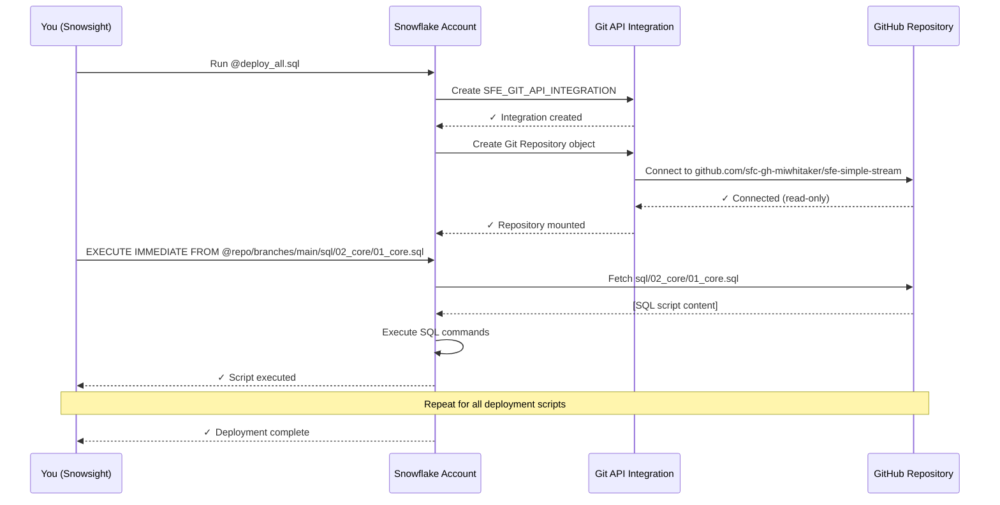

# Deployment Guide - Simple Stream

**Time to Complete:** ~1 minute  
**Prerequisites:** Completed [`01-SETUP.md`](01-SETUP.md)

---

## Purpose

This guide walks you through deploying the complete Simple Stream pipeline using Snowflake's Git integration for one-command deployment.

## Deployment Overview

The pipeline uses **Git-based deployment**:
1. Snowflake creates a Git repository object pointing to GitHub
2. Deployment script uses `EXECUTE IMMEDIATE FROM @repo/...` to run scripts directly from GitHub
3. No manual file uploads required - everything pulls from version control

**Total Time:** ~45 seconds

---

## Quick Deployment

###Step 1: Deploy Pipeline

Copy and paste this single script into a Snowsight worksheet:

```sql
@deploy_all.sql
```

**What it does:**
1. Creates `SNOWFLAKE_EXAMPLE` database
2. Creates API integration for GitHub access
3. Creates Git repository object pointing to this repo
4. Executes core infrastructure scripts from Git
5. Executes analytics scripts from Git
6. Executes task automation scripts from Git
7. Executes monitoring view scripts from Git
8. Validates deployment with summary query

**Expected Runtime:** 45-60 seconds

**Expected Output:**
```
Database SNOWFLAKE_EXAMPLE created
API Integration SFE_GIT_API_INTEGRATION created
Git Repository sfe_simple_stream_repo created
Executing 01_core.sql...
Executing 02_analytics.sql...
Executing 03_tasks.sql...
Executing 04_monitoring.sql...

Validation Results:
+----------+-------+----+
| OBJECT   | COUNT | OK |
+----------+-------+----+
| Schemas  |     4 | ✓  |
| Tables   |     5 | ✓  |
| Views    |     7 | ✓  |
+----------+-------+----+
```

### Step 2: Verify Deployment

Run the validation script:

**Validation is now automatic!** The `deploy_all.sql` script includes comprehensive validation at the end. You'll see a summary table showing:
- ✅ Schemas: 3 / 3
- ✅ Streams: 1 / 1
- ✅ Tables: 5 / 5
- ✅ Tasks: 2 / 2
- ✅ Views: 7 / 7

**What it checks:**
- ✅ All schemas created
- ✅ All tables exist and have correct structure
- ✅ Stream is tracking RAW table
- ✅ Tasks are created (suspended until auth configured)
- ✅ Pipe is created and ready
- ✅ Monitoring views are queryable
- ✅ Sample dimension data loaded

**Expected Runtime:** 10 seconds

**Expected Output:**
```
Comprehensive Validation Report
================================

SCHEMAS:
✓ RAW_INGESTION
✓ STAGING_LAYER
✓ ANALYTICS_LAYER
✓ DEMO_REPO

TABLES:
✓ RAW_BADGE_EVENTS (0 rows - awaiting data)
✓ STG_BADGE_EVENTS (0 rows - awaiting data)
✓ FCT_ACCESS_EVENTS (0 rows - awaiting data)
✓ DIM_USERS (3 rows - sample data loaded)
✓ DIM_ZONES (4 rows - sample data loaded)

STREAMS:
✓ sfe_badge_events_stream (tracking RAW_BADGE_EVENTS)

TASKS:
✓ sfe_raw_to_staging_task (SUSPENDED - awaiting activation)
✓ sfe_staging_to_analytics_task (SUSPENDED - awaiting activation)

PIPES:
✓ sfe_badge_events_pipe (RUNNING - ready for data)

VIEWS:
✓ 7 monitoring views created

Status: DEPLOYMENT SUCCESSFUL ✓
```

---

## What Was Created

### Database Structure

```
SNOWFLAKE_EXAMPLE/
├── RAW_INGESTION/
│   ├── RAW_BADGE_EVENTS (table)
│   ├── sfe_badge_events_stream (stream)
│   ├── sfe_badge_events_pipe (pipe)
│   ├── sfe_raw_to_staging_task (task, suspended)
│   ├── sfe_staging_to_analytics_task (task, suspended)
│   └── V_* (7 monitoring views)
├── STAGING_LAYER/
│   └── STG_BADGE_EVENTS (table)
├── ANALYTICS_LAYER/
│   ├── DIM_USERS (table with sample data)
│   ├── DIM_ZONES (table with sample data)
│   └── FCT_ACCESS_EVENTS (table, empty)
└── DEMO_REPO/
    └── sfe_simple_stream_repo (git repository stage)
```

### Account-Level Objects

```
API Integrations:
└── SFE_GIT_API_INTEGRATION (GitHub access)
```

### Data Flow Architecture

```
┌─────────────────┐
│  REST API Call  │
└────────┬────────┘
         │
         ▼
┌─────────────────┐
│ sfe_badge_      │ ← Snowpipe Streaming endpoint
│ events_pipe     │
└────────┬────────┘
         │
         ▼
┌─────────────────┐
│ RAW_BADGE_EVENTS│ ← Raw landing table
└────────┬────────┘
         │
         ▼
┌─────────────────┐
│ sfe_badge_      │ ← Stream tracks changes
│ events_stream   │
└────────┬────────┘
         │
         ▼
┌─────────────────┐
│ Task 1: Dedupe  │ ← Runs every 1 min (when activated)
└────────┬────────┘
         │
         ▼
┌─────────────────┐
│ STG_BADGE_EVENTS│ ← Staging table (deduplicated)
└────────┬────────┘
         │
         ▼
┌─────────────────┐
│ Task 2: Enrich  │ ← Runs after Task 1 (when activated)
└────────┬────────┘
         │
         ▼
┌─────────────────┐
│ DIM_USERS       │
│ DIM_ZONES       │
│ FCT_ACCESS      │ ← Analytics ready
│   _EVENTS       │
└─────────────────┘
```

---

## Understanding Git-Based Deployment

### Why Git Integration?

**Traditional Deployment:**
1. ❌ Download SQL files to local machine
2. ❌ Upload files to Snowflake stage
3. ❌ Execute scripts one by one
4. ❌ Update files when changes occur
5. ❌ Re-upload and re-execute

**Git-Based Deployment:**
1. ✅ Snowflake connects directly to GitHub
2. ✅ Executes scripts directly from repository
3. ✅ Always uses latest version
4. ✅ No manual file management
5. ✅ Version controlled deployment

### How It Works



### Security

**Read-Only Access:**
- ✅ Snowflake can only READ from GitHub
- ✅ Cannot push changes or write files
- ✅ No credentials stored (public repository)

**Limited Scope:**
- ✅ API integration restricted to `https://github.com/` only
- ✅ Cannot access other domains
- ✅ Shared safely across demo projects

---

## Post-Deployment Status

### Tasks (Currently SUSPENDED)

Tasks are deployed but **not yet running**. They require authentication configuration first:

| Task | Schedule | Status | Reason |
|------|----------|--------|--------|
| sfe_raw_to_staging_task | Every 1 minute | ⏸️ SUSPENDED | Awaiting activation |
| sfe_staging_to_analytics_task | After parent task | ⏸️ SUSPENDED | Awaiting activation |

**To activate tasks:** Complete authentication setup in the next guide.

### Pipe (RUNNING)

The Snowpipe Streaming endpoint is **ready immediately**:

| Component | Status | Notes |
|-----------|--------|-------|
| sfe_badge_events_pipe | ✅ RUNNING | Ready to receive data |

**To use pipe:** Complete authentication setup, then send test events.

### Sample Data

Dimension tables are pre-loaded with sample data:

```sql
-- View sample users
SELECT * FROM ANALYTICS_LAYER.DIM_USERS;

-- View sample zones
SELECT * FROM ANALYTICS_LAYER.DIM_ZONES;
```

**Expected Output:**
- 3 sample users (USR-001, USR-002, USR-003)
- 4 sample zones (ZONE-LOBBY-1, ZONE-OFFICE-201, ZONE-LAB-301, ZONE-EXIT-1)

---

## Troubleshooting

### "API Integration already exists"

**Symptom:** `Object 'SFE_GIT_API_INTEGRATION' already exists`  
**Cause:** Integration was created in a previous deployment  
**Fix:** This is OK! The script uses `CREATE ... IF NOT EXISTS`, so it's safe to re-run. The existing integration will be reused.

**Verify:**
```sql
SHOW API INTEGRATIONS LIKE 'SFE_GIT%';
```

### "Access denied to GitHub"

**Symptom:** `Access Denied` error when creating Git repository  
**Cause:** Network policy blocking github.com or API integration not enabled  
**Fix:**
```sql
-- Verify integration is enabled
SHOW API INTEGRATIONS LIKE 'SFE_GIT_API_INTEGRATION';
-- Look for ENABLED = true

-- If needed, enable it:
USE ROLE ACCOUNTADMIN;
ALTER API INTEGRATION SFE_GIT_API_INTEGRATION SET ENABLED = TRUE;
```

### "Script not found in repository"

**Symptom:** `File not found: @repo/branches/main/sql/...`  
**Cause:** Repository structure changed or network issue  
**Fix:**
```sql
-- Verify repository is accessible
ALTER GIT REPOSITORY sfe_simple_stream_repo FETCH;

-- List files in repository
LIST @sfe_simple_stream_repo/branches/main/sql/;
```

### "Validation shows missing objects"

**Symptom:** Validation query shows < 4 schemas or < 5 tables  
**Cause:** Partial deployment failure  
**Fix:** Re-run the deployment script - it's idempotent and safe to run multiple times.

### "Warehouse timeout"

**Symptom:** Query times out after 300 seconds  
**Cause:** Warehouse too small or suspended  
**Fix:**
```sql
-- Resume warehouse
ALTER WAREHOUSE COMPUTE_WH RESUME;

-- Increase size if needed (for large deployments)
ALTER WAREHOUSE COMPUTE_WH SET WAREHOUSE_SIZE = 'SMALL';
```

---

## Deployment Verification Checklist

Run these queries to verify deployment:

```sql
-- Check database exists
SHOW DATABASES LIKE 'SNOWFLAKE_EXAMPLE';

-- Check schemas
SHOW SCHEMAS IN DATABASE SNOWFLAKE_EXAMPLE;

-- Check tables
SHOW TABLES IN SCHEMA RAW_INGESTION;
SHOW TABLES IN SCHEMA STAGING_LAYER;
SHOW TABLES IN SCHEMA ANALYTICS_LAYER;

-- Check stream
SHOW STREAMS IN SCHEMA RAW_INGESTION;

-- Check tasks
SHOW TASKS IN SCHEMA RAW_INGESTION;

-- Check pipe
SHOW PIPES IN SCHEMA RAW_INGESTION;

-- Check views
SHOW VIEWS IN SCHEMA RAW_INGESTION;

-- Check Git repository
SHOW GIT REPOSITORIES IN SCHEMA DEMO_REPO;

-- Check API integration
USE ROLE ACCOUNTADMIN;
SHOW API INTEGRATIONS LIKE 'SFE_GIT%';
```

**Expected:** All queries return results (no empty result sets).

---

## Re-Deployment

If you need to re-deploy (e.g., to get latest changes from GitHub):

### Option 1: Full Re-Deployment (Clean Slate)
```sql
-- Remove everything
@sql/99_cleanup/cleanup.sql

-- Deploy fresh
@deploy_all.sql
```

### Option 2: Selective Re-Deployment (Keep Data)
```sql
-- Update specific component
EXECUTE IMMEDIATE FROM @DEMO_REPO.sfe_simple_stream_repo/branches/main/sql/04_monitoring/04_monitoring.sql;
```

### Option 3: Fetch Latest from GitHub
```sql
-- Pull latest changes
USE SCHEMA DEMO_REPO;
ALTER GIT REPOSITORY sfe_simple_stream_repo FETCH;

-- Then re-run deployment
@deploy_all.sql
```

---

## What's Next?

### Immediate Next Steps

✅ **Deployment Complete!**

**→ Next:** [`03-TESTING.md`](03-TESTING.md) - Configure authentication and send test events (10 minutes)

### Optional: Deep Dive

Before testing, you may want to:
- Review monitoring views: [`04-MONITORING.md`](04-MONITORING.md)
- Send integration guide to vendors: [`06-DATA-PROVIDER-QUICKSTART.md`](06-DATA-PROVIDER-QUICKSTART.md)
- Examine architecture diagrams: [`../diagrams/`](../diagrams/)

---

## Related Documentation

### Internal Team
- [`01-SETUP.md`](01-SETUP.md) - Previous: Prerequisites and setup
- [`03-TESTING.md`](03-TESTING.md) - Next: Configure auth and test
- [`04-MONITORING.md`](04-MONITORING.md) - Monitor pipeline health
- [`../deploy_all.sql`](../deploy_all.sql) - Deployment script source

### External Data Providers
- [`06-DATA-PROVIDER-QUICKSTART.md`](06-DATA-PROVIDER-QUICKSTART.md) - **Send to vendors** (10-minute integration)
- [`05-API-HANDOFF.md`](05-API-HANDOFF.md) - Complete API reference

